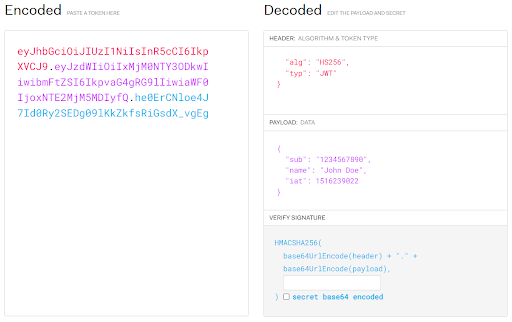

# JSON Web Tokens

# Why use a JWT vs Session Authentication?

Traditionally, in session authentication, the user carries a cookie to verify themselves. This is fine until the service a user needs to access scales horizontally, and then the multiple instances of the service don’t know about each other’s cached state. As a result, there will need to be a **traffic manager** that would redirect traffic to the specific service that the user would be authenticated in.

On the other hand, with stateless JWT authentication, the user’s request does not need to be directed to any specific service, as all of them can be used to authenticate a user.

# What is JWT?

A JWT consists of a **header**, **payload**, and a **signature**. They are in the form `<header>.<payload>.<signature>` where the three sections are encoded into lists of bytes that are separated by full-stops. The header and payload represent JSON objects, whereas the signature is a hash. All of them are base64 encoded.
Any times in a JWT are numeric dates (_Numeric dates are defined as the number of seconds from 1970-01-01T00:00:00Z_).

[This link](https://jwt.io/) shows how JWTs look.



The header contains the hashing algorithm used for the signature, and the type of the token (“JWT”).

The payload is what actually contains the data being carried, it contains **claims** (facts about the user, covered below). Examples of claims are:

- `“sub”` field refers to the subject of the token, it may contain a certain user’s ID or email, or something that uniquely identifies them

- `“iat”` field refers to what time the token was issued at. You can also have a field for the expiration time or the time the token is valid for.

The way the signature is built, is the following:

```
HASHING_ALGORITHM_SPECIFIED_IN_HEADER(
    base64UrlEncode(header) + "." + base64UrlEncode(payload),
    SECRET_KEY
)
```

**NOTE:** sometimes the `SECRET_KEY` is also base64url encoded

**NOTE:** the `SECRET_KEY` must be at least as long (in bits) as the hashing algorithm, e.g., HMACSHA256 requires 256-bit

The secret key is kept far hidden from any users, in something like the AWS secrets manager, and shared between the services.

Since the signature makes use of the encoded versions of the payload and header as well, the authenticity of communication can also be proven (or disproven) by comparing the signature generated from the given payload and header.

# Claims and Roles

A claim is any information about an authenticated user, carried in the payload of their JWT. Claims can be simply regarded as a key-value pair. Claims are often used when fetching data to ensure that user-specific data is fetched (i.e., not all posts ever on a platform, but only the posts that were posted by the currently signed in user).

Any field in the payload section of a JWT is regarded to be a claim.

- **Registered claims** are claims that are agreed-upon standard claims that are recommended to include in all JWTs.

- **Public claims** have to be collision-resistant – their names should be unlike any other claim. They are often prefixed with UUIDs, OIDs or domain names.

- **Private claims** are like public claims but don’t have to be collision-resistant, as only the consumer and issuer of the JWT know about them.

A **role** is an ‘access level’ for a certain user. There could be a suite of endpoints of an API (such as those for the creation of other users) that would require something like an admin role to be authorised to make use of. Roles are efficient to lock larger groups of users to specific sections of accessibility.

Roles can be implemented with claims, by creating a “roles” field in the payload, and attaching it to an array of string values relating to the roles of a certain user. Something like the below as the JWT payload.

```json
{
  "sub": "some subject",
  ...
  "roles": ["Admin", "Supervisor"]
}
```

Alternatively, you can keep roles stored in some form of persistent storage relating to the subject of the JWT (represented by the “sub” field) in a database accessible by the API to call upon on demand.

# What is a refresh token?

The JWT can expire before some time, and it's not unlikely that the user wants to keep doing other actions. In order to overcome this, the JWT is returned with a refresh token as well from the Auth server. Whereas the JWT is valid for maybe 15 minutes, the refresh token can be valid for even up to a year.

This also reduces the risk of a man-in-the-middle attack, where the attacker gets access to the short-lived JWT, without the refresh token to reinstate it.

To implement it, there needs to be a /refresh endpoint. This endpoint would be used by the user with the expired JWT and the valid refresh token. Next, the authentication API returns a new JWT and a new refresh token.

In the case of a data breach, you could invalidate all refresh tokens to make all users have to log in again.
In many cases, the client-side would have a middleware that would (on each request to the API), send a request to the /refresh endpoint if the JWT is expired to refresh it first.
