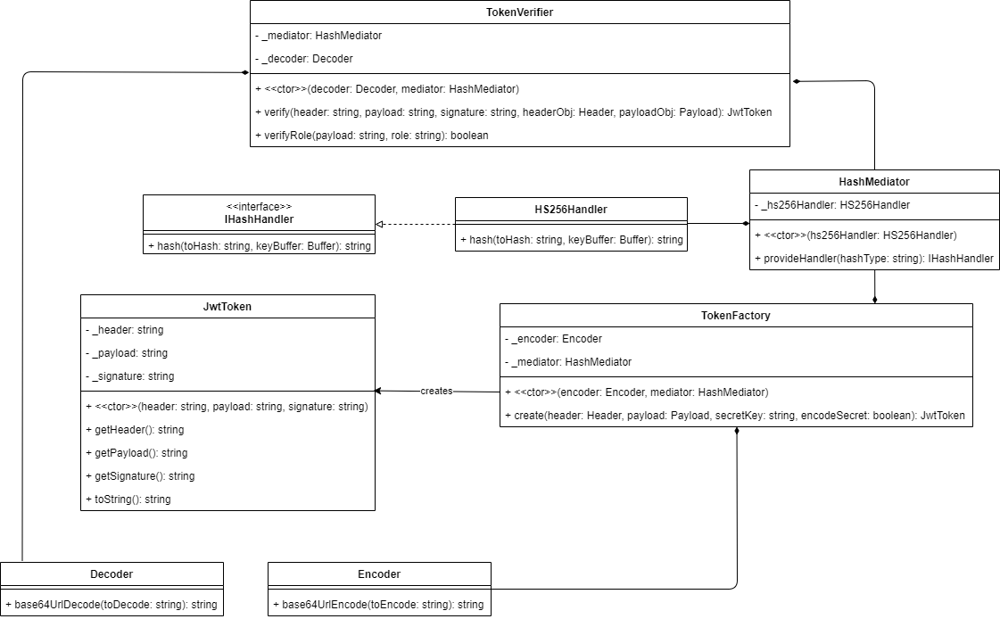
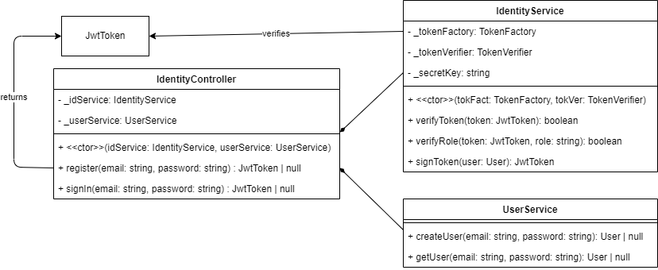

# Structure of this project

## jwt module (under src/jwt)

The `HashMediator` could be used as a mediator for more than just the HMACSHA256 algorithm, but it's
the only one I wanted to implement.
Each hash handler class must implement the `IHashHandler` interface.

In the code, the `TokenFactory` class has an interface associated with it, whereas the `TokenVerifier`
class doesn't. The interface is not necessary at all, since there is no need to implement the class
in multiple ways.

The `Encoder` and `Decoder` classes are used to convert between base64url format and UTF-8.

**NOTE:** I didn't implement refresh tokens.

## api module (under src/api)

This module comes under two parts, the authentication 'API' and the data 'API'.

### auth API (under src/api/auth)

### data API (under src/api/data)

